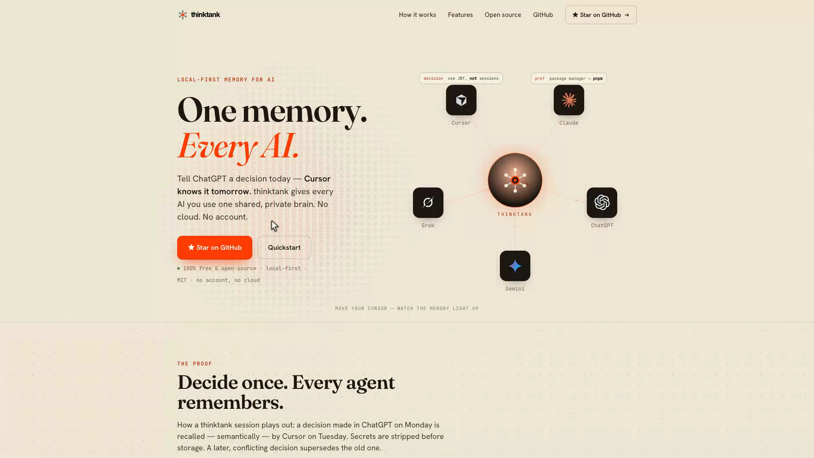

<h1 align="center">scrolltape</h1>

<p align="center"><b>Paste a link → get a smooth, cursor-guided demo video of any website.</b></p>

<p align="center">
  
  
  
  
</p>

<p align="center">
  <a href="https://ahkamboh.github.io/scrolltape/"><b>🌐 Live site</b></a> ·
  <a href="https://github.com/ahkamboh/scrolltape/raw/main/docs/demo.mp4"><b>▶ Watch the demo</b></a>
</p>

<p align="center">
  <a href="https://github.com/ahkamboh/scrolltape/raw/main/docs/demo.mp4">
    
  </a>
</p>

---

## What it is

One command turns any URL into a polished screen recording — **smooth auto-scroll**, an **animated cursor**, a hero pause — exported as **MP4 + WebM**. Great for landing-page demos, launch tweets, and README headers. Runs **100% on your machine** (Playwright + ffmpeg) — nothing is uploaded.

## Install (once)

```bash
git clone https://github.com/ahkamboh/scrolltape ~/scrolltape
cd ~/scrolltape
npm install
npx playwright install chromium          # the headless browser
```

You also need **ffmpeg** (renders the MP4/WebM):

| macOS | Ubuntu | Windows |
|-------|--------|---------|
| `brew install ffmpeg` | `sudo apt install ffmpeg` | `winget install ffmpeg` |

## Use it

```bash
node bin/scrolltape.mjs https://yoursite.com
```

→ writes `renders/yoursite-scrolltape.mp4` (and `.webm`).

Add a flavor:

```bash
node bin/scrolltape.mjs https://yoursite.com --cursor cute-paw --tour interactive-hero --scroll slow
```

## Options

| Flag | Values | Default |
|------|--------|---------|
| `--cursor` | white-pointer · mac-hand · cute-paw · brand-dot | white-pointer |
| `--tour` | standard · interactive-hero · hero-only · quick-teaser · deep-dive · feature-focus | standard |
| `--viewport` | landscape · portrait · square | landscape |
| `--scroll` | slow · normal · fast | normal |
| `--hero` | seconds to hold on the hero | 3 |
| `--focus` | section ids to emphasize (`a,b,c`) | — |
| `-o, --output` | output filename base | `<domain>-scrolltape` |

Full help: `node bin/scrolltape.mjs --help`

## Use it from your AI agent (optional)

scrolltape ships an **agent skill** — set it up once, then just paste URLs to **Cursor / Claude Code / Codex** and it records them for you.

<details>
<summary><b>One-time agent setup</b></summary>

Paste this to your agent a single time:

```
Set up scrolltape (one time): https://github.com/ahkamboh/scrolltape
1. Clone to ~/scrolltape, then run:  npm install && npx playwright install chromium
2. Copy skills/scrolltape/SKILL.md into my agent's skills folder
   (Cursor: ~/.cursor/skills/ · Claude: ~/.claude/skills/ · Codex: ~/.codex/skills/)
3. Confirm ready — after this I'll just paste site links.
```

After that, daily use is just a URL:

```
scrolltape https://myapp.com
```

The agent reads [`skills/scrolltape/SKILL.md`](skills/scrolltape/SKILL.md), runs the recorder, and returns the `renders/*.mp4`.
</details>

## How it works

Playwright opens the page headless and records it while scrolltape drives a smooth eased scroll and a cursor overlay; ffmpeg trims the load-in and exports MP4 + WebM. No cloud, no upload.

## License

[MIT](LICENSE) © [ahkamboh](https://github.com/ahkamboh) · built with [Cursor](https://cursor.com) ([PARTNERS.md](PARTNERS.md))
