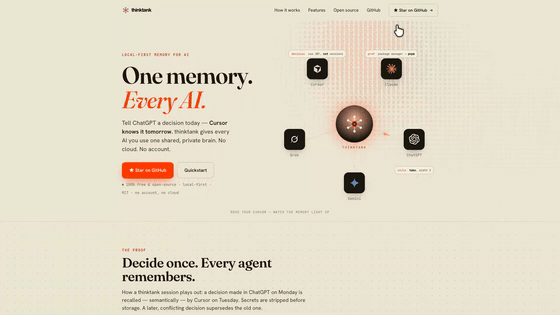

<h1 align="center">scrolltape</h1>

<p align="center"><b>Paste a link → get a smooth, cursor-guided demo video of any website.</b></p>

<p align="center">
  
  
  
  
</p>

<p align="center">
  <a href="https://ahkamboh.github.io/scrolltape/"><b>🌐 Live site</b></a> ·
  <a href="https://github.com/ahkamboh/scrolltape/raw/main/docs/demo.mp4"><b>▶ Watch the demo</b></a>
</p>

<p align="center">
  
  <br/>
  <sub><a href="https://ahkamboh.github.io/scrolltape/demo.mp4">▶ watch the full video</a></sub>
</p>

---

## ⚡ Set it up with your AI agent

Paste this into **Cursor, Claude Code, Codex — or any AI agent** and it sets scrolltape up for you (one time). After that, you only paste URLs.

```
You are setting up scrolltape — paste a link, get a smooth, cursor-guided demo video
of any website (github.com/ahkamboh/scrolltape). It runs 100% on my machine. Set it up:

1. clone + install (one time):
   git clone https://github.com/ahkamboh/scrolltape ~/scrolltape
   cd ~/scrolltape && npm install && npx playwright install chromium
2. make sure ffmpeg is installed (it renders the MP4/WebM) — if `ffmpeg -version` fails,
   install it: macOS brew install ffmpeg · Ubuntu sudo apt install ffmpeg · Windows winget install ffmpeg
3. install the skill so future requests need only a URL — copy skills/scrolltape/SKILL.md
   into my agent's skills folder (Cursor ~/.cursor/skills/ · Claude ~/.claude/skills/ · Codex ~/.codex/skills/)
4. confirm ready — after this I'll just paste a site link and you record it.
```

## Daily use — just paste a link

After setup, no clone and no flags needed — just send a URL:

```
scrolltape https://yoursite.com
```

Optionally tweak it:

```
scrolltape https://yoursite.com
cursor: cute-paw
tour: interactive-hero
```

Your agent reads [`skills/scrolltape/SKILL.md`](skills/scrolltape/SKILL.md), records it, and returns the `renders/*.mp4`.

## Or run the CLI yourself

```bash
cd ~/scrolltape
node bin/scrolltape.mjs https://yoursite.com --cursor cute-paw --tour interactive-hero
```

→ writes `renders/yoursite-scrolltape.mp4` (and `.webm`).

## Options

| Flag | Values | Default |
|------|--------|---------|
| `--cursor` | mac-hand · white-pointer · cute-paw · brand-dot | mac-hand |
| `--tour` | standard · interactive-hero · hero-only · quick-teaser · deep-dive · feature-focus | standard |
| `--viewport` | landscape · portrait · square | landscape |
| `--scroll` | slow · normal · fast | normal |
| `--hero` | seconds to hold on the hero | 3 |
| `--focus` | section ids to emphasize (`a,b,c`) | — |
| `--visit` | also tour these routes in the same demo (`/pricing,/about`) | — |
| `--follow` | auto-follow the nav links and tour those pages too | off |
| `-o, --output` | output filename base | `<domain>-scrolltape` |

Full help: `node bin/scrolltape.mjs --help`

## How it works

Playwright opens the page headless and records it while scrolltape drives a smooth, eased scroll and a cursor overlay; ffmpeg trims the load-in and exports MP4 + WebM. No cloud, no upload — 100% on your machine.

## License

[MIT](LICENSE) © [ahkamboh](https://github.com/ahkamboh) · built with [Cursor](https://cursor.com) ([PARTNERS.md](PARTNERS.md))
